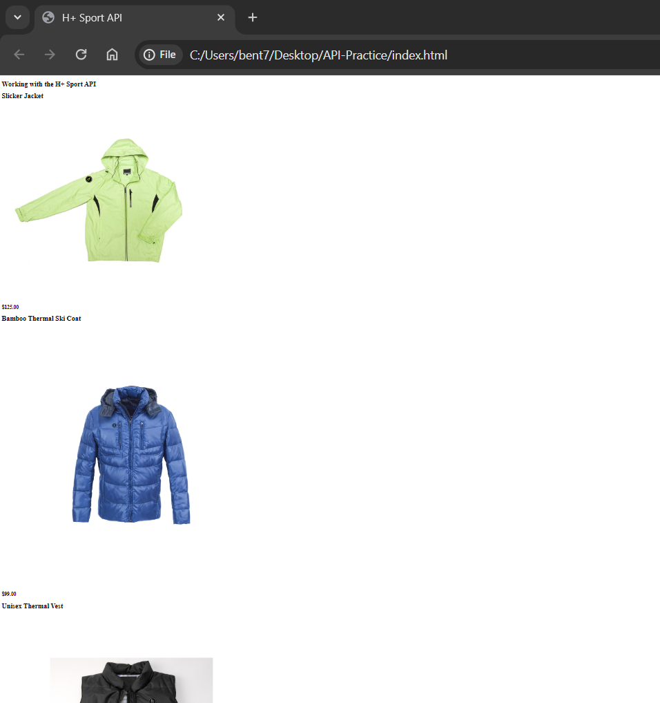

# API-Practice

Thank you for taking the time to visit my quick coding project! In this repository, you'll find out more on how I used a quick guide from LinkedIn Learning to learn more about APIs. in this code, you'll be able to see how I:
1) Connected to an API to pull data all from scratch.
2) Filter that data using parameters
3) Access certain parts of the data
4) And finally, display all that data in a comprehensible format on an HTML webpage.

